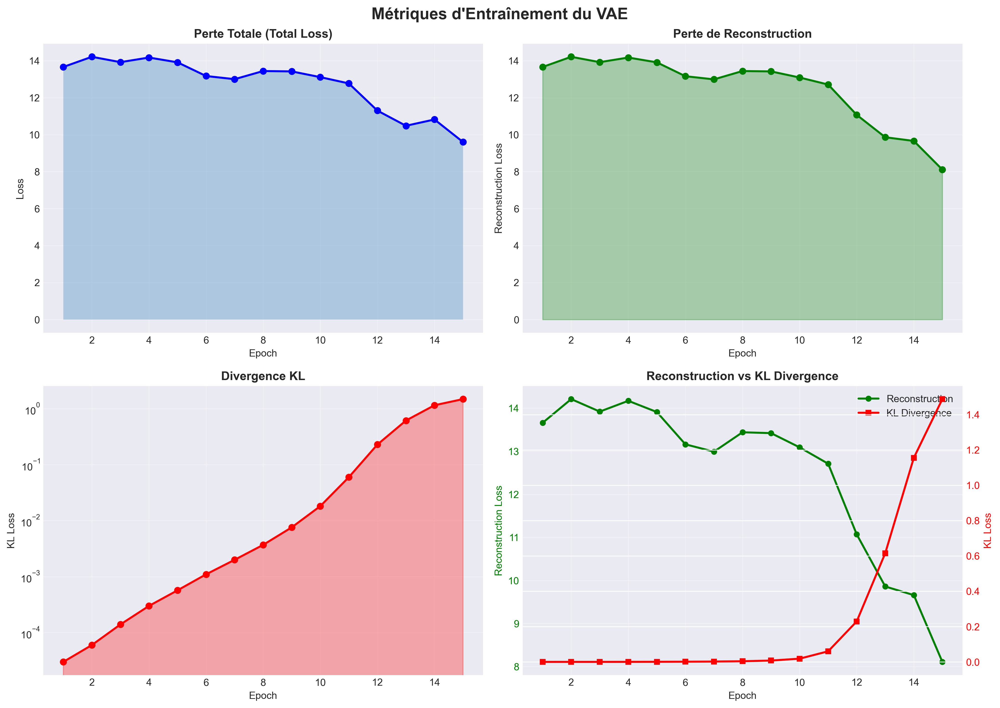
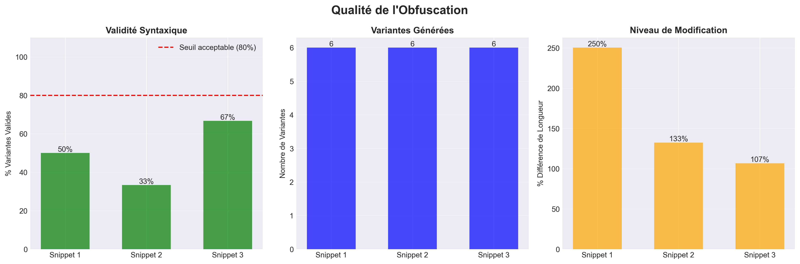
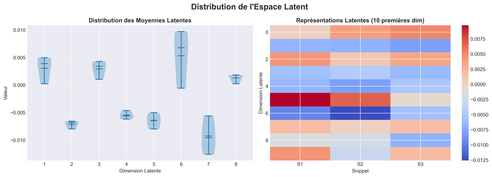

# 🔐 Projet d'Obfuscation de Code Python avec VAE

## 📋 Description du Projet

Ce projet implémente un système d'obfuscation de code Python utilisant plusieurs techniques :

- **Renommage de variables** : Transformation des noms de variables en identifiants génériques
- **Ajout de code mort** : Insertion de code inutile pour complexifier la lecture
- **Modification d'espaces** : Ajout de commentaires et modification de la structure
- **VAE (Variational Autoencoder)** : Génération de variantes de code via apprentissage profond

## 🏗️ Structure du Projet

```
Projet/
├── data/                          # Dossier contenant les snippets d'entraînement
│   ├── snippet1.py               # Exemple : fonction add
│   ├── snippet2.py               # Exemple : fonction factorial
│   └── snippet3.py               # Exemple : fonction greet
├── model_vae.py                  # Modèle VAE (encoder/decoder)
├── obfuscate.py                  # Pipeline d'obfuscation
├── train.py                      # Script d'entraînement du VAE
├── tests.py                      # Tests sans VAE
├── tests_with_vae.py             # Tests avec VAE
└── README.md                     # Ce fichier
```

## 🔧 Installation

### Prérequis

- Python 3.8 ou supérieur
- pip (gestionnaire de paquets Python)

### Étape 1 : Installer les dépendances

```bash
pip install tensorflow numpy
```

Ou avec un fichier `requirements.txt` :

```bash
# Créer requirements.txt avec :
cat > requirements.txt << EOF
tensorflow>=2.14.0
numpy>=1.24.0
EOF

# Puis installer :
pip install -r requirements.txt
```

### Étape 2 : Vérifier l'installation

```bash
python -c "import tensorflow as tf; print('TensorFlow version:', tf.__version__)"
```

## 🚀 Utilisation

### Option 1 : Tests Rapides (Sans VAE)

Si vous voulez tester rapidement les techniques d'obfuscation de base :

```bash
python tests.py
```

**Résultat attendu :**

- Affichage de 3 snippets originaux
- Pour chaque snippet : 2-3 variantes obfusquées
- Validation syntaxique de chaque variante

### Option 2 : Utilisation Complète (Avec VAE)

#### Étape 1 : Entraîner le modèle VAE

```bash
python train.py
```

**Ce que fait ce script :**

1. Charge tous les fichiers `.py` du dossier `data/`
2. Entraîne le VAE pendant 15 epochs
3. Sauvegarde les poids dans :
   - `vae_encoder.weights.h5`
   - `vae_decoder.weights.h5`
   - `vae_tokenizer.json`

**Durée estimée :** 1-2 minutes

**Résultat attendu :**

```
Attention: dataset petit. Ajoute des snippets dans data/*.py pour un meilleur entraînement.
Epoch 1/15
1/1 ━━━━━━━━━━━━━━━━━━━━ 15s - kl_loss: 3.28e-05 - loss: 13.66 ...
...
Epoch 15/15
1/1 ━━━━━━━━━━━━━━━━━━━━ 0s - kl_loss: 1.53 - loss: 8.46 ...
Entraînement terminé. Poids sauvegardés (vae_encoder.weights.h5, vae_decoder.weights.h5).
```

#### Étape 2 : Tester avec le VAE

```bash
python tests_with_vae.py
```

**Ce que fait ce script :**

1. Charge le modèle VAE entraîné
2. Applique les techniques d'obfuscation classiques
3. Génère des variantes via le VAE
4. Valide la syntaxe de chaque variante

**Résultat attendu :**

```
============================================================
TESTS AVEC VAE (Variational Autoencoder)
============================================================

========================================
SNIPPET 1 (original):
def add(a, b):
    return a + b

print(add(2,3))

--- variante 1 ✓ (validité syntaxique: True) ---
def _0(_1, _2):
    return _1 + _2

_3(_0(2,3))

--- variante 2 ✓ (validité syntaxique: True) ---
# Auto-generated code
_unused_var_1 = lambda x: x * 2
_unused_var_2 = [i for i in range(10)]

def add(a, b):
    return a + b

print(add(2,3))

[... autres variantes incluant celles générées par le VAE ...]
```

## 📚 Utilisation Programmatique

### Dans votre propre code Python

```python
from obfuscate import obfuscate_snippet

# Code original
code = """
def add(a, b):
    return a + b

print(add(2, 3))
"""

# Générer des variantes sans VAE
variants_simple = obfuscate_snippet(code, n_variants=2, use_vae=False)

# Générer des variantes avec VAE (nécessite d'avoir entraîné le modèle)
variants_vae = obfuscate_snippet(code, n_variants=3, use_vae=True)

# Afficher les résultats
for i, variant in enumerate(variants_vae, 1):
    print(f"=== Variante {i} ===")
    print(variant)
    print()
```

## 🎯 Améliorer le Modèle VAE

Pour obtenir de meilleurs résultats avec le VAE :

### 1. Ajouter plus de snippets d'entraînement

Ajoutez vos propres fichiers Python dans le dossier `data/` :

```bash
# Créer de nouveaux snippets
echo "def multiply(x, y):
    return x * y" > data/snippet4.py

echo "def is_even(n):
    return n % 2 == 0" > data/snippet5.py
```

### 2. Ajuster les hyperparamètres

Modifiez `train.py` ligne 25 :

```python
# Augmenter le nombre d'epochs
wrapper = VAEWrapper.train_on_texts(
    texts,
    epochs=30,           # Augmenter de 15 à 30
    batch_size=8,
    latent_dim=32,
    maxlen=256
)
```

### 3. Ajuster la dimension latente

Pour des codes plus complexes :

```python
wrapper = VAEWrapper.train_on_texts(
    texts,
    epochs=15,
    batch_size=8,
    latent_dim=64,      # Augmenter de 32 à 64
    maxlen=512          # Augmenter si vos codes sont longs
)
```

## 🔍 Comprendre les Résultats

### Métriques d'entraînement

Pendant l'entraînement, vous verrez 3 métriques :

1. **loss (perte totale)** : Devrait diminuer → le modèle apprend
2. **reconstruction_loss** : Mesure la capacité à reconstruire le code original
3. **kl_loss** : Mesure la régularisation de l'espace latent (devrait augmenter légèrement)

**Bon entraînement :**

```
Epoch 1/15: loss: 13.66, kl_loss: 0.00003
Epoch 15/15: loss: 8.46, kl_loss: 1.53
```

✅ La perte totale diminue, KL loss augmente modérément

**Mauvais entraînement :**

```
Epoch 1/15: loss: 13.66, kl_loss: 0.00003
Epoch 15/15: loss: 13.50, kl_loss: 0.00005
```

❌ Presque aucun changement → le modèle n'apprend pas

### Qualité des variantes

Une bonne variante devrait :

- ✅ Être syntaxiquement valide (peut être parsée par Python)
- ✅ Ressembler au code original mais avec des modifications
- ✅ Conserver la structure générale du code

Une mauvaise variante :

- ❌ Erreurs de syntaxe
- ❌ Code complètement illisible ou corrompu
- ❌ Perte totale de la structure

## 🐛 Résolution de Problèmes

### Problème 1 : Erreur d'importation TensorFlow

```
ImportError: No module named 'tensorflow'
```

**Solution :**

```bash
pip install --upgrade tensorflow
```

### Problème 2 : Modèle VAE non trouvé

```
FileNotFoundError: vae_encoder.weights.h5 not found
```

**Solution :**

```bash
# Entraîner d'abord le modèle
python train.py
```

### Problème 3 : Dataset trop petit

```
Attention: dataset petit. Ajoute des snippets dans data/*.py
```

**Solution :**
Ajoutez plus de fichiers `.py` dans le dossier `data/`. Le VAE fonctionne mieux avec au moins 10-20 snippets.

### Problème 4 : Variantes VAE invalides syntaxiquement

**Cause :** Le modèle n'a pas assez appris (dataset trop petit ou pas assez d'epochs)

**Solution :**

1. Ajouter plus de snippets dans `data/`
2. Augmenter le nombre d'epochs dans `train.py`
3. Relancer l'entraînement

### Problème 5 : Erreurs oneDNN

```
oneDNN custom operations are on...
```

**Ce n'est PAS une erreur** - Ce sont juste des informations. Vous pouvez les ignorer ou les masquer :

```bash
# Sur Windows (PowerShell)
$env:TF_ENABLE_ONEDNN_OPTS="0"
python train.py

# Sur Linux/Mac
export TF_ENABLE_ONEDNN_OPTS=0
python train.py
```

## 📊 Architecture du VAE

### Composants principaux

```
Input (code Python)
    ↓
[CharTokenizer] → Convertit en séquence de nombres
    ↓
[Encoder] → LSTM Bidirectionnel → Espace latent (z)
    ↓
[Sampling] → Échantillonnage gaussien
    ↓
[Decoder] → LSTM → Séquence de tokens
    ↓
Output (code obfusqué)
```

### Paramètres par défaut

- **Tokenizer** : Caractères ASCII (32-127)
- **Max length** : 256 caractères
- **Latent dim** : 32 dimensions
- **Encoder** : Embedding(32) → BiLSTM(128)
- **Decoder** : LSTM(128) → Dense(vocab_size)

## 🎓 Concepts Clés

### VAE (Variational Autoencoder)

Un VAE est un réseau de neurones qui :

1. **Encode** le code en une représentation compacte (espace latent)
2. **Sample** un point dans cet espace avec du bruit
3. **Decode** ce point pour générer une variante

### Obfuscation

Transformation du code pour le rendre moins lisible tout en préservant sa fonctionnalité :

- **Renommage** : `add` → `_0`
- **Code mort** : Ajout de variables inutilisées
- **Restructuration** : Modification des espaces/commentaires

## 📝 Notes Importantes

⚠️ **Ce projet est à but pédagogique uniquement**

- Ne pas utiliser pour cacher du code malveillant
- Les variantes générées peuvent ne pas être fonctionnellement équivalentes
- Le VAE nécessite un dataset conséquent pour de bons résultats

## 🤝 Contribuer

Pour améliorer ce projet :

1. Ajoutez plus de techniques d'obfuscation dans `obfuscate.py`
2. Améliorez l'architecture du VAE dans `model_vae.py`
3. Créez des tests plus complets
4. Ajoutez des métriques de qualité des variantes

## 📄 Licence

Projet pédagogique - Libre d'utilisation pour l'apprentissage

## 👨‍💻 Auteur

Projet de démonstration pour l'apprentissage de l'obfuscation de code et des VAE

---

**Dernière mise à jour :** Octobre 2025
**Version :** 1.0.0

## 📊 Métriques et Visualisations

### Générer les graphiques d'évaluation

Après avoir entraîné le modèle, vous pouvez générer des visualisations détaillées :

```bash
python visualize_metrics.py
```

### Graphiques générés

#### 1. 📈 Courbes d'Entraînement



Ce graphique montre l'évolution pendant l'entraînement :

- **Perte Totale** : Devrait diminuer → le modèle apprend
- **Reconstruction Loss** : Mesure la qualité de reconstruction du code
- **KL Divergence** : Régularisation de l'espace latent (augmente légèrement)
- **Comparaison** : Vue combinée des deux pertes

**Interprétation :**

- ✅ **Bon** : Loss totale diminue de ~13 à ~8-9
- ✅ **Bon** : KL loss augmente progressivement (pas de "collapse")
- ❌ **Mauvais** : Loss stagne ou augmente

#### 2. ✅ Qualité de l'Obfuscation



Trois métriques importantes :

- **Validité Syntaxique** : % de variantes sans erreur de syntaxe
  - 🎯 Objectif : > 80%
- **Nombre de Variantes** : Combien de versions différentes sont générées
- **Niveau de Modification** : Différence de longueur (proxy pour changements)

**Interprétation :**

- ✅ **Excellent** : 90-100% de validité syntaxique
- ⚠️ **Acceptable** : 70-90% de validité
- ❌ **Problème** : < 70% → Le modèle a besoin de plus d'entraînement

#### 3. 🗺️ Espace Latent



Visualisation de l'espace latent appris par le VAE :

- **Distribution des moyennes** : Montre comment les codes sont encodés
- **Heatmap** : Représentations latentes de différents snippets

**Interprétation :**

- ✅ **Bon** : Distribution proche d'une gaussienne centrée
- ✅ **Bon** : Snippets similaires ont des représentations proches
- ❌ **Problème** : Valeurs extrêmes ou distribution uniforme

### Métriques Clés

| Métrique                | Valeur Typique | Interprétation              |
| ----------------------- | -------------- | --------------------------- |
| **Perte Finale**        | 8-10           | Plus c'est bas, mieux c'est |
| **KL Divergence**       | 1.0-2.0        | Régularisation active       |
| **Validité Syntaxique** | > 80%          | Qualité des variantes       |
| **Variantes Uniques**   | 3-5            | Diversité                   |

### Pourquoi ces métriques ?

Contrairement aux tâches de classification (où on utilise précision/rappel/F1), l'obfuscation de code est une **tâche générative**. Les métriques appropriées sont :

❌ **Non pertinent pour ce projet :**

- Précision / Recall
- Matrice de confusion
- Accuracy
- F1-Score

✅ **Pertinent pour ce projet :**

- Perte de reconstruction (qualité)
- KL divergence (régularisation)
- Validité syntaxique (correction)
- Diversité des variantes (créativité)
- Distance d'édition (niveau d'obfuscation)

### Améliorer les Résultats

Si vos métriques ne sont pas satisfaisantes :

1. **Validité syntaxique basse (< 70%)** :

   ```bash
   # Augmenter les epochs et la taille du dataset
   # Modifier train.py : epochs=30
   ```

2. **KL divergence trop faible (< 0.1)** :

   ```python
   # Dans model_vae.py, augmenter le poids de KL :
   total_loss = reconstruction_loss + 2.0 * kl_loss  # au lieu de 1.0
   ```

3. **Perte ne diminue pas** :
   - Ajouter plus de snippets dans `data/`
   - Augmenter `latent_dim` à 64
   - Augmenter la taille du LSTM (128 → 256)

### Exporter les Métriques

Les résultats sont automatiquement sauvegardés dans `examples/` :

- `training_curves.png` - Courbes d'entraînement
- `obfuscation_quality.png` - Qualité des variantes
- `latent_space.png` - Visualisation de l'espace latent

Ces graphiques sont parfaits pour inclure dans un rapport, une présentation, ou votre README GitHub !
